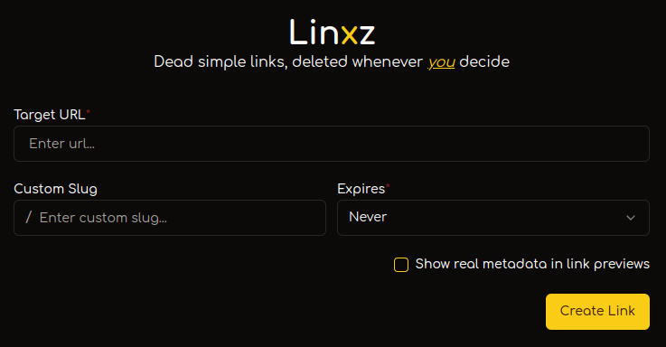

# 🔗 Linxz | Short, self-destructable links

<p align="center">
    
</p>


## About

Linxz is an easy-to-use, self-hostable, and private link sharing platform. It provides a simple interface to shorten links and includes granular control over their experation. You can specify a date and time or a number of clicks until the link is deleted forever. Or, if you want it forever, that works too.

## Self-Hosting

### Environment Variables

| Name                           | Description                                                                                                                                                                    | Default                            | Required |
| ------------------------------ | ------------------------------------------------------------------------------------------------------------------------------------------------------------------------------ | ---------------------------------- | -------- |
| `BASE_URL`                     | The base url of your applications. Links will be formatted like `<BASE_URL>/l/<slug>`                                                                                          | `http://localhost:3000` (in `dev`) | ✅        |
| `DB_URL`                       | The URL of your [libSQL](https://github.com/tursodatabase/libsql) database. This can be remote (`http/https`) or local (`file`).                                               | `file:///linxz.db`                 |          |
| `DB_AUTH_TOKEN`                | The authentication token for your remote database.                                                                                                                             | `undefined`                        |          |
| `NEXT_PUBLIC_CFTS_SITE_KEY`    | Your Cloudflare Turnstile site key. This is used to prevent spam, and there will be no spam protection without it. This is required when `CFTS_SECRET_KEY` is set.             | `undefined`                        |          |
| `CFTS_SECRET_KEY`              | Your Cloudflare Turnstile secret key. This is used to prevent spam, and there will be no spam protection without it. This is required when `NEXT_PUBLIC_CFTS_SITE_KEY` is set. | `undefined`                        |          |
| `NEXT_PUBLIC_APTABASE_HOST`    | The host url of your [Aptabase](https://aptabase.com/) instance (e.g. `https://aptabase.example.com`). This will default to ([Aptabase Cloud](https://aptabase.com/)).         | `undefined`                        |          |
| `NEXT_PUBLIC_APTABASE_APP_KEY` | The app key of your [Aptabase](https://aptabase.com/) app (e.g. `A-SH-0123456789`). By default, analytics will not be enabled.                                                 | `undefined`                        |          |

### Using Docker Compose (Recommended)
1. Create a `docker-compose.yml` file with the following contents:
```yaml
name: linxz

services:
  linxz:
    image: ghcr.io/ngregrichardson/linxz:latest
    container_name: linxz
    restart: always
    ports:
      - 80:3000
    volumes:
      - linxz/linxz.db:/app/linxz.db
    environment:
      - BASE_URL

      # Uncomment the next line to specify a different local or remote database location
      # - DB_URL

      # Uncomment the next line to specify an authentication token for a remote database
      # - DB_AUTH_TOKEN

      # Uncomment the next two lines to use Cloudflare Turnstile
      # - NEXT_PUBLIC_CFTS_SITE_KEY
      # - CFTS_SECRET_KEY

volumes:
  linxz:
```

> **Note:** This file can also be found in [examples/docker-compose.yml](examples/docker-compose.yml)
> 

2. Configure the `docker-compose.yml` file with the required environment variables plus any additional you'd like to configure
3. Run `docker compose up` to start the container
4. Visit [`http://localhost`](http://localhost) to view your new Linxz instance!
5. Once you see it was successful, you can stop the container and start it again using `-d` to run it in the background

### Using Docker
1. Create a `.env` file with the required environment variables plus any additional you'd like to configure.
```
BASE_URL=http://localhost:80
```
2. Create a new volume with `docker volume create linxz`
3. Run `docker run --env-file .env -p 80:3000 -v hello/linxz.db:/app/linxz.db ghcr.io/ngregrichardson/linxz:latest --name linxz` to start the container
4. Visit [`http://localhost`](http://localhost) to view your new Linxz instance!
5. Once you see it was successful, you can stop the container and start it again using `-d` to run it in the background

## Contributing
If you would like to contribute, please feel free to fork the repository and submit a pull request. I will review it as soon as possible. I've been enjoying [pnpm](https://pnpm.io/), but feel free to develop with your preferred runtime.

> **Note:** Please do not include other lock files in your pull request.

### Running for Development

All steps will use `pnpm` commands, but you're welcome to replace them with whatever you prefer.

1. Clone the repository
2. Run `pnpm install`
3. Run `pnpm dev` and visit [`http://localhost:3000`](http://localhost:3000)